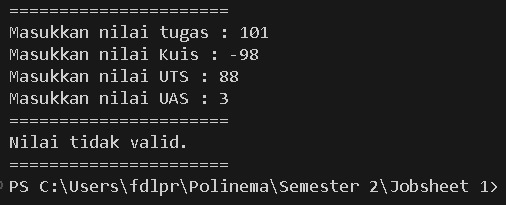

|            | Algorithm and Data Structure |
| ---------- | ---------------------------- |
| NIM        | 244107020142                 |
| Nama       | Faatihurrizki Prasojo        |
| Kelas      | TI - 1H                      |
| Repository | [link] ()                    |

# Jobsheet 1 | Basic Programming Concepts

## 2.2.1 Selection Practicum

The solution was implemented in the Looping Practicum and here is a screenshot of the result.

**Brief Explanation:** There are 4 main steps:

1. Input all values
2. Validate the input
3. Calculate and convert to final grade and letter grade
4. Decide the final status

## 2.3.1. Lopping Practicum

The solution was implemented in the Looping Practicum and here is a screenshot of the result.

**Brief Explanation:** There are 3 main steps:

1. NIM Input
2. Find the “n” of the last 2 numbers by modulus 100
3. Display the sequence of numbers 1 to n except 6 and 10 and odd numbers are printed “\*”

## 2.4.1. Array Practicum

The solution was implemented in the Arrat=y Practikum and gere is a screenshot of the result

**Brief Explanation:** There are 3 main steps:

1. Input of Course grades
2. Convert MK grades to letter grades and equivalent grades
3. IP is obtained from the number of equivalent grades multiplied by the number of credits for each MK and the total is divided by the total number of credits.

## 2.5.1. Function Practicum

The solution was implemented in the Function Practicum and here is a screenshot of the result.

(Screenshot/ss5.jpg)

**Brief explanation:** There are 4 main steps:

1. Input the interest of each store branch
2. Price details Aglonela = 75,000, Taro = 50,000, Rose = 10,000, Alocasia = 60,000
3. Display price when all flowers are sold out
4. Show the stock of each branch if the flowers die with details Aglonema -1, Keladi -2, Alocasia -0, MAwar -5

## Tasks

### Case 1

The solution was implemented in Task 1 and here is a screenshot of the result.

**Brief Explanation:** There are 2 main steps:

1. Input the license plate code as stated
2. if valid, it will display the city name with the inputted license plate code

### Case 2

The solution is implemented in Task 2 and here is the screenshot of the result.

**Brief explanation:** There are 6 main steps:

1. Input Cube Ribs
2. Menu Input
3. Menu 1 will calculate the Volume by multiplying the ribs by 3.
4. Menu 2 will calculate the Surface Area by raising the ribs by 2 and then multiplying the result by 6.
5. Menu 3 will calculate the Perimeter by multiplying the ribs by 12.
6. Menu 4 exits

### Case 3

The solution is implemented in Task 2 and here is the screenshot of the result.

**Brief explanation:** There are 2 main steps:

1. Input details of each course (name, credits, semester, day)
2. Choose Menu

   \- Case 1: Display the entire course schedule

   \- Case 2: Display the lecture schedule based on a specific day

   \- Case 3: Displaying lecture schedules based on a specific semester

   \- Case 4: Search for courses by name

   \- case 5 : exits
