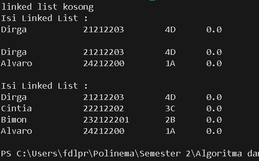
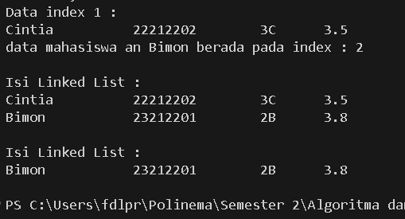
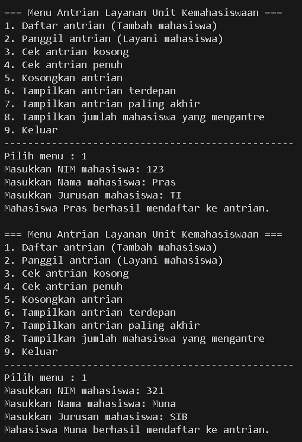
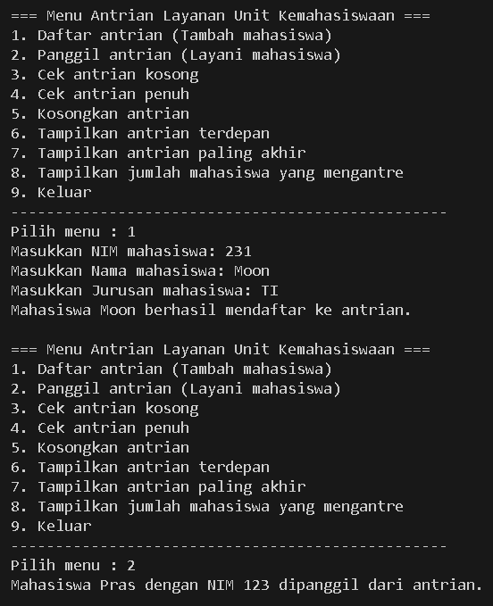
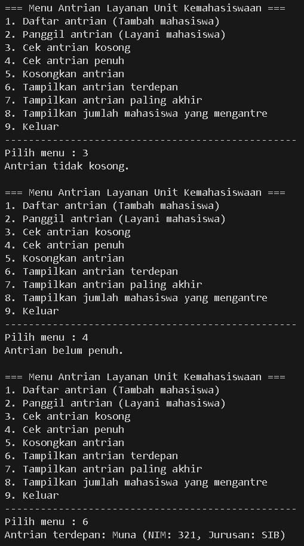
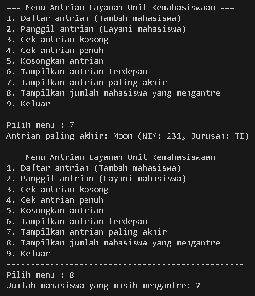

|            | Algorithm and Data Structure |
| ---------- | ---------------------------- |
| NIM        | 244107020142                 |
| Nama       | Faatihurrizki Prasojo        |
| Kelas      | TI - 1H                      |
| Repository | [link] ()                    |

# Jobsheet 11 | Linked List

## 2.1 Pembuatan Single Linked List

### 2.1.1 Verifikasi Hasil Percobaan 



### 2.1.2 Pertanyaan

1. Mengapa hasil compile kode program di baris pertama menghasilkan “Linked List Kosong”?
    =karena belum ada data (head = null), maka list dianggap kosong, dan pesan “Linked List Kosong” ditampilkan.

2. Jelaskan kegunaan variable temp secara umum pada setiap method!
    - Menelusuri node-node dari `head` hingga node tertentu (biasanya dalam loop)
    - Menyimpan referensi node sementara sebelum atau sesudah dilakukan perubahan (seperti saat insert atau delete)
    - Menghindari perubahan langsung terhadap ponter `head` atau `tail`

3.  Lakukan modifikasi agar data dapat ditambahkan dari keyboard!
```
System.out.print("Masukkan jumlah data: ");
int jumlah = sc.nextInt();
sc.nextLine(); // konsumsi newline

for (int i = 0; i < jumlah; i++) {
    System.out.println("Data ke-" + (i + 1));
        System.out.print("NIM: ");
        String nim = sc.nextLine();
        System.out.print("Nama: ");
        String nama = sc.nextLine();
        System.out.print("Kelas : ");
        String kelas = sc.nextLine();
        System.out.print("Nilai: ");
        double nilai = sc.nextDouble();
        sc.nextLine(); 
        Mahasiswa08 mhs = new Mahasiswa08(nim, nama, kelas ,nilai);
        sll.addFirst(mhs);
}
```

## 2.2 Modifikasi Elemen pada Single Linked List

### 2.2.2 Verifikasi Hasil Percobaan



### Pertanyaan

1. Mengapa digunakan keyword break pada fungsi remove? jelaskan!
    -`break` digunakan untuk menghentikan loop `while` saat node dengan nama yang sesuai (`key`) telah ditemukan dan dihapus
    - tanpa `break`, program akan terus melanjutkan iterasi meskipun node yang dimaksud sudah dihapus, yang menyebabkan :
        - Penghapusan yang tidak perlu (jika ada nama yang sama lebih dari satu, padahal hanya satu yang ingin dihapus),
        - error, jika pointer tidak ditangani dengan benar
        - Kinerja lebih lambat karena melakukan looping yang tidak perlu

2. Jelaskan kegunaan kode dibawah pada method remove
```
temp.next = temp.next.next;
if(temp.next == null) {
    tail = temp;
}
```

Kedua baris ini digunakan untuk:

- Menyambungkan kembali list dengan melewati node yang dihapus,

- Menjaga keakuratan pointer `tail` jika node yang dihapus adalah node terakhir.

Tanpa ini, linked list akan menjadi tidak konsisten, berpotensi menyebabkan error atau data rusak.

## Tugas







