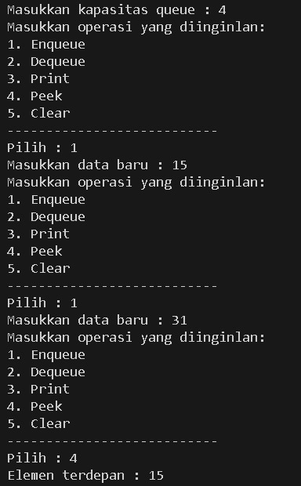
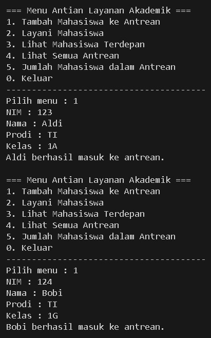
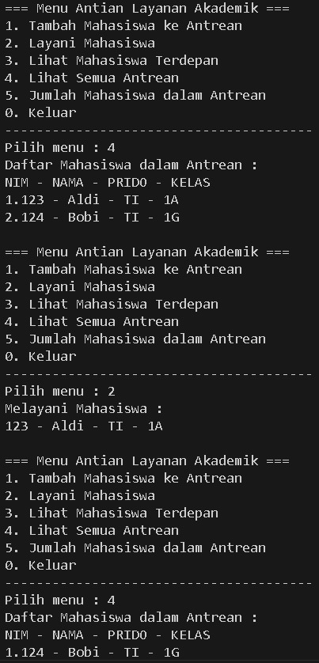
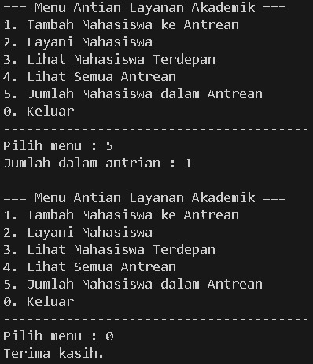
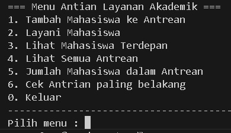
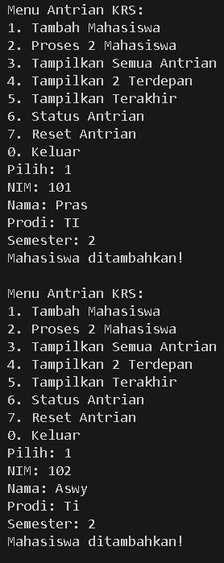
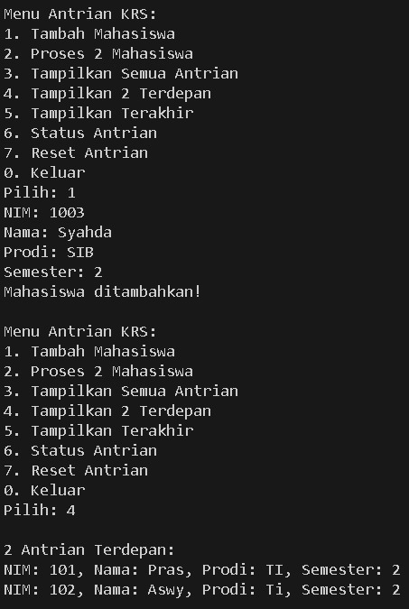
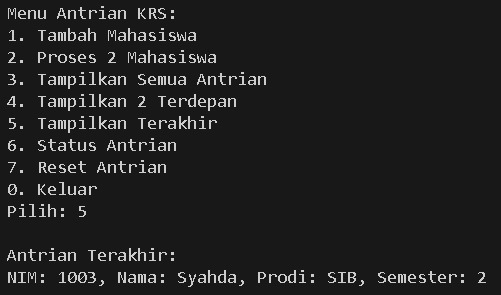
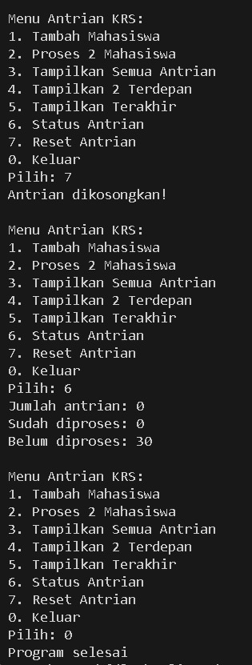

|            | Algorithm and Data Structure |
| ---------- | ---------------------------- |
| NIM        | 244107020142                 |
| Nama       | Faatihurrizki Prasojo        |
| Kelas      | TI - 1H                      |
| Repository | [link] ()                    |

# Jobsheet 10 | Queue

## 2.1 Percobaan 1 : Operasi Dasar Queue

### 2.1.2 Verifikasi Hasil Percobaan



### 2.1.3 Pertanyaan

1. Pada konstruktor, mengapa nilai awal atribut front dan rear bernilai -1, sementara atribut size bernilai 0

    Jawab:

    Atribut front dan rear bernilai -1 pada konstruktor queue (antrian) karena:

    - Menandakan antrian kosong: Nilai -1 digunakan sebagai penanda bahwa belum ada elemen sama sekali di dalam antrian. Pada kondisi ini, baik posisi depan (front) maupun belakang (rear) dari antrian belum menunjuk ke indeks manapun dalam array penyimpanan data
    - Membedakan kondisi kosong dan penuh: Dengan menggunakan -1, kode dapat dengan mudah membedakan antara antrian yang benar-benar kosong dan antrian yang sudah terisi. Saat elemen pertama dimasukkan (enqueue), baik front maupun rear diinisialisasi ke 0, menandakan posisi pertama dalam array telah teris

    Atribut size bernilai 0 karena:

    - Menunjukkan jumlah elemen: size digunakan untuk menghitung berapa banyak elemen yang sedang ada di dalam antrian. Pada saat konstruktor dijalankan, antrian masih kosong sehingga jumlah elemennya adalah 0.

    - Memudahkan pengecekan kondisi: Dengan size bernilai 0, fungsi seperti IsEmpty() dapat dengan mudah mengecek apakah antrian kosong hanya dengan memeriksa apakah size == 0

2. Pada method Enqueue, jelaskan maksud dan kegunaan dari potongan kode berikut!
```
if (rear == max - 1) {
    rear = 0;
}
```

jawab : 
    
Misalkan ukuran array queue (max) adalah 5:

- Jika rear saat ini berada di indeks 4 (max - 1), maka setelah enqueue berikutnya, rear di-set ke 0, sehingga elemen baru akan ditempatkan di awal array, bukan melebihi batas array

3. Pada method Dequeue, jelaskan maksud dan kegunaan dari potongan kode berikut!
```
if (front == max - 1) {
    front = 0;
}
```

Jawab :
    
    - Kode ini memungkinkan queue untuk menggunakan seluruh ruang array secara efisien.

    - Setelah elemen di indeks paling akhir (max-1) dikeluarkan, elemen berikutnya yang akan dikeluarkan adalah yang berada di indeks 0, jika ada.

    - Ini mencegah pemborosan memori karena tidak perlu menggeser seluruh isi array saat ada ruang kosong di depan.

    - Dengan "memutar" indeks front ke 0, queue tetap dapat menerima dan mengeluarkan elemen secara berulang tanpa perlu memperbesar array atau menggeser data secara manual.


4. Pada method print, mengapa pada proses perulangan variabel i tidak dimulai dari 0 (int i=0), melainkan int i=front?

Jawab : 

Jika perulangan dimulai dari 0 (i = 0), maka akan mencetak dari indeks 0, padahal urutan sebenarnya di queue adalah dari indeks 3 ke 4 lalu ke 0 dan 1 (karena circular).

Dengan memulai dari i = front, perulangan akan mencetak dari indeks 3, lalu 4, lalu 0, lalu 1, sesuai urutan antrian.

5. Perhatikan kembali method print, jelaskan maksud dari potongan kode berikut! 
```
i = (i + 1) % max;
```

Jawab : 

Potongan kode `i = (i + 1) % max;` berfungsi untuk membuat perulangan indeks array menjadi sirkular, sehingga setelah mencapai indeks terakhir, indeks kembali ke 0. Ini sangat penting dalam implementasi queue berbasis array sirkular agar semua elemen queue dapat diakses dan dicetak dengan benar.

6. Tunjukkan potongan kode program yang merupakan queue overflow! 

Jawab :

```
public void tambahAntrean (Mahasiswa mhs) {
    if (IsFull()) {
        System.out.println("Antrean penuh, tidak dapat menambah mahasiswa.");
        return; // <-- INI MENANDAKAN OVERFLOW, DATA BARU TIDAK DIMASUKKAN
    }
    rear = (rear + 1) % max;
    data[rear] = mhs;
    size++;
    System.out.println(mhs.nama + " berhasil masuk ke antrean.");
}
```

7. Pada saat terjadi queue overflow dan queue underflow, program tersebut tetap dapat berjalan dan hanya menampilkan teks informasi. Lakukan modifikasi program sehingga pada saat terjadi queue overflow dan queue underflow, program dihentikan!

```
public void Enqueue(int dt) {
    if (IsFull()) {
        System.out.println("Queue sudah penuh, program dihentikan!");
        System.exit(1); // Hentikan program
    } else {
        if (IsEmpty()) {
            front = rear = 0;
        } else {
            rear = (rear + 1) % max; // Circular queue
        }
        data[rear] = dt;
        size++;
    }
}

public int Dequeue() {
    if (IsEmpty()) {
        System.out.println("Queue masih kosong, program dihentikan!");
        System.exit(1); // Hentikan program
        return 0; // Baris ini tidak akan pernah dijalankan (hanya untuk kompilasi)
    } else {
        int dt = data[front];
        size--;
        if (IsEmpty()) {
            front = rear = -1;
        } else {
            front = (front + 1) % max; // Circular queue
        }
        return dt;
    }
}
```

## 2.2 Percobaan 2 : Antrian Layanan Akademik

### 2.2.2 Verifikasi Hasil Percobaan







### 2.2.3 Pertanyaan

Lakukan modifikasi program dengan menambahkan method baru bernama LihatAkhir pada class AntrianLayanan yang digunakan untuk mengecek antrian yang berada di posisi belakang. Tambahkan pula daftar menu 6. Cek Antrian paling belakang pada class LayananAkademikSIAKAD sehingga method LihatAkhir dapat dipanggil!

`Modifikasi class AntrianLayanan`

```
public void lihatAkhir() {
    if (IsEmpty()) {
        System.out.println("Antrean kosong.");
    } else {
        System.out.print("Mahasiswa paling belakang : ");
        System.out.println("NIM - NAMA - PRODI - KELAS");
        data[rear].tampilkanData();
    }
}
```

Setelah dimodifikasi maka menu akan menjadi seperti ini : 



## 2.3 Tugas








