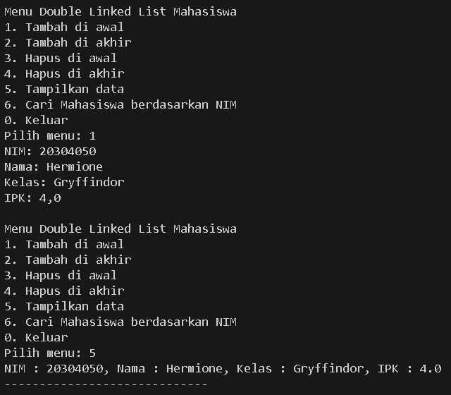
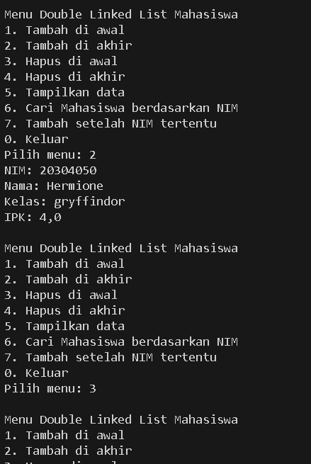

|            | Algorithm and Data Structure |
| ---------- | ---------------------------- |
| NIM        | 244107020142                 |
| Nama       | Faatihurrizki Prasojo        |
| Kelas      | TI - 1H                      |
| Repository | [link] ()                    |

# Jobsheet 12 | Double Linked List 

## 12.2 Praktikum 1

### 12.2.2 Verifikasi Hasil Percobaan



### Pertanyaan

1. Jelaskan perbedaan antara single linked list dengan double linked lists!

    = Single linked list adalah struktur data di mana setiap node hanya memiliki satu pointer yang mengarah ke node berikutnya, sehingga traversal hanya bisa dilakukan satu arah (maju saja). Sebaliknya, double linked list memiliki dua pointer di setiap node: satu ke node berikutnya dan satu lagi ke node sebelumnya, sehingga traversal bisa dilakukan dua arah (maju dan mundur). Double linked list lebih fleksibel untuk operasi penghapusan atau penyisipan di tengah, tapi membutuhkan lebih banyak memori karena menyimpan dua pointer per node

2. Perhatikan class Node01, di dalamnya terdapat atribut `next` dan `prev`. Untuk apakah 
atribut tersebut?

    - `next` :
        - Menunjuk ke node berikutnya dalam daftar.
        - Berguna saat melakukan traversal ke depan (maju). 

    - `prev` :
        - Menunjuk ke node sebelumnya dalam daftar.
        - Berguna untuk traversal ke belakang (mundur), atau operasi seperti insertBefore() atau removeLast() secara efisien.

3. Perhatikan konstruktor pada class DoubleLinkedLists. Apa kegunaan dari konstruktor tersebut?

```
public DoubleLinkedList08() {
    head = null;
    tail = null;
}
```
- Menginisialisasi list kosong
Konstruktor ini dijalankan saat objek `DoubleLinkedList08` dibuat. Dengan `head = null` dan `tail = null`, artinya linked list belum memiliki node (masih kosong).

- Mempersiapkan struktur awal list
Memberikan kondisi awal yang jelas sebelum node pertama ditambahkan.
Ini penting agar method seperti `addFirst()` atau `isEmpty()` dapat bekerja dengan benar.

4. Pada method addFirst(), apa maksud dari kode berikut?
```
if(isEmpty()) {
    head = tail = newNode08;
}
```
- Menangani kasus khusus saat list masih kosong
- Menetapkan node pertama sebagai head dan tail
- Mencegah error pointer saat menambahkan node pertama kali

5. Perhatikan pada method addFirst().  Apakah arti statement head.prev = newNode ? 

    = Node yang sebelumnya menjadi head sekarang menunjuk kembali ke node baru yang ditambahkan di depan (newNode08).

6. Modifikasi code pada fungsi print() agar dapat menampilkan warning/ pesan bahwa linked lists masih dalam kondisi.
```
public void print() {
    if (isEmpty()) {
        System.out.println("Linked list masih kosong.");
        return;
    }

    Node08 current = head;
    System.out.println("Isi data Mahasiswa:");
    while (current != null) {
        current.data.tampil();
        current = current.next;
    }
    System.out.println("-----------------------------");
}
```

7. Pada insertAfter(), apa maksud dari kode berikut ?
```
current.next.prev = newNode08;
```
- Menjaga integritas pointer prev dari node setelah current
- Memastikan hubungan dua arah (bidirectional) tetap terjaga dan konsisten

8. Modifikasi menu pilihan dan switch-case agar fungsi insertAfter() masuk ke dalam menu pilihan dan dapat berjalan dengan baik.
```
case 7 -> {
    System.out.print("Masukkan NIM yang akan disisipkan setelahnya: ");
    String keyNim = pras.nextLine();
    Mahasiswa08 mhs = inputMahasiswa(pras);
    list.insertAftrer(keyNim, mhs);
}
```
## 12.3 Praktikum 2

### 12.3.2 Verifikasi Hasil Percobaan



### 12.3.3 Pertanyaan Percobaan

1. Apakah maksud statement berikut pada method `removeFirst()`?
```
head = head.next;
head.prev = null;
```
- `head = head.next;` :
    - Geser `head` ke node berikutnya. Node lama yang tadinya jadi `head` sekarang "dilupakan" (tidak dirujuk lagi), sehingga siap dihapus oleh garbage collector.

- `head.prev = null;` :
    - Putuskan hubungan balik (pointer `prev`) dari node baru yang menjadi head, agar tidak lagi menunjuk ke node lama (yang dihapus).

2. Modifikasi kode program untuk menampilkan pesan "Data sudah berhasil dihapus. Data yang terhapus adalah.."

```
public void removeFirst() {
    if (isEmpty()) {
        System.out.println("Linked list kosong, tidak bisa menghapus.");
        return;
    }

    Mahasiswa08 removedData = head.data; // Simpan data sebelum dihapus

    if (head == tail) {
        head = tail = null;
    } else {
        head = head.next;
        head.prev = null;
    }

    System.out.println("Data sudah berhasil dihapus. Data yang terhapus adalah:");
    removedData.tampil();
}
```

## Tugas

1. Tambahkan Method `add(index, data)`
```
    public void addFirst(Mahasiswa08 data) {
        Node08 newNode08 = new Node08(data);
        if (isEmpty()) {
            head = tail = newNode08;
        } else {
            newNode08.next = head;
            head.prev = newNode08;
            head = newNode08;
        }
    }

    public void addLast(Mahasiswa08 data) {
        Node08 newNode08 = new Node08(data);
        if (isEmpty()) {
            head = tail = newNode08;
        } else {
            tail.next = newNode08;
            newNode08.prev = tail;
            tail = newNode08;
        }
    }
```

2. Tambahkan Method `removeAfter()`
```
    public void removeAfter(String keyNIM) {
        if (isEmpty()) {
            System.out.println("List kosong, tidak bisa menghapus.");
            return;
        }

        Node08 current = head;

        while (current != null && !current.data.nim.equals(keyNIM)) {
            current = current.next;
        }
        if (current == null) {
            System.out.println("Data dengan NIM " + keyNIM + " tidak ditemukan.");
            return;
        }
        if (current.next == null) {
            System.out.println("Tidak ada node setelah data dengan NIM " + keyNIM);
            return;
        }

        Node08 nodeToRemove = current.next;
        current.next = nodeToRemove.next;

        if (nodeToRemove.next != null) {
            nodeToRemove.next.prev = current;
        } else {
            tail = current;
        }
        System.out.println("Node setelah NIM " + keyNIM + " berhasil dihapus.");
    }
```

3. Tambahkan Method `remove()`
```
    public void remove(String keyNim) {
        if (isEmpty()) {
            System.out.println("List kosong, tidak bisa menghapus.");
            return;
        }

        Node08 current = head;

        while (current != null && !current.data.nim.equals(keyNim)) {
            current = current.next;
        }
        if (current == null) {
            System.out.println("Data dengan NIM " + keyNim + " tidak ditemukan.");
            return;
        }
        if (current == head) {
            head = head.next;
            if (head != null) {
                head.prev = null;
            } else {
                tail = null;
            }
            System.out.println("Node dengan NIM " + keyNim + " berhasil dihapus (sebagai head).");
            return;
        }
        if (current == tail) {
            tail = tail.prev;
            tail.next = null;
            System.out.println("Node dengan NIM " + keyNim + " berhasil dihapus (sebagai tail).");
            return;
        }
        current.prev.next = current.next;
        current.next.prev = current.prev;
        System.out.println("Node dengan NIM " + keyNim + " berhasil dihapus.");
    }
```

4. Tambahkan Method `getFirst()`, `getLast()`, `getIndex`