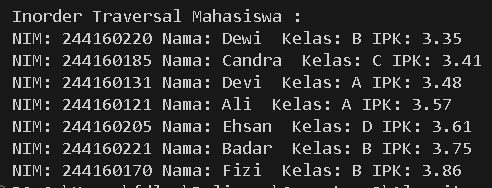

|            | Algorithm and Data Structure |
| ---------- | ---------------------------- |
| NIM        | 244107020142                 |
| Nama       | Faatihurrizki Prasojo        |
| Kelas      | TI - 1H                      |
| Repository | [link] ()                    |

# Jobsheet 14 | Tree

## 14.2 Implementasi Binary Search Tree menggunakan Linked List

### 14.2.1 Verifikasi Hasil


### 14.2.2 Pertanyaan Percobaan

1. Mengapa dalam binary search tree proses pencarian data bisa lebih efektif dilakukan dibanding binary tree biasa?
    = Pada binary search tree operasi pencarian data serta penyisipan dan penghapusan lebih seimbang dengan kompleksitas logaritmik (*O*(log *n*)), jauh lebih efisien daripada pencarian linear(*O*(*n*)) yang mungkin terjadi pada binary tree yang tidak terurut

2. Untuk apakah di class `Node`, kegunaan dari atribut `left` dan `right`?
    - `left`    : Atribut `left` (atau `left` child) digunakan untuk menunjuk ke node anak yang berada di kiri dari node saat ini, node yang ditunjuk oleh `left` akan selalu memiliki nilai (`ipk`) yang lebih kecil dari node induknya.
    - `right`   : Atribut `right` (atau `right` child) digunakan untuk menunjuk ke node anak yang ditunjuk oleh oleh `right` akan selalu memiliki nilai(`ipk`) yang lebih besar dari node indukya.

3. - Untuk apakah kegunaan dari atribut `root` di dalam class `BinaryTree`?
        -  atribut `root` dalam kelas `BinaryTree` berfungsi sebagai titik awal (akar) pohon. Ini krusial karena semua operasi pada pohon, seperti menambahkan, mencari, menghapus, atau menjelajahi node, dimulai dari `root`. Atribut ini juga digunakan untuk mengecek apakah pohon kosong.
    - Ketika objek tree pertama kali dibuat, apakah nilai dari `root`?
        - Ketika objek `BinaryTree08` pertama kali dibuat melalui konstruktor `public` `BinaryTree08()`, nilai dari atribut `root` adalah `null`. Hal ini karena konstruktor menginisialisasi `root` dengan `null`, menunjukkan bahwa pohon biner tersebut awalnya kosong.

4. Ketika tree masih kosong, dan akan ditambahkan sebuah node baru, proses apa yang terjadi?
- Cek Kondisi Kosong: Metode `add` pertama-tama akan memeriksa apakah pohon kosong (`isEmpty()` mengembalikan `true`).
- Assign ke Root: Karena pohon kosong (`root` adalah `null`), node baru yang dibuat akan langsung ditugaskan sebagai `root` dari pohon tersebut. Ini berarti `root` yang sebelumnya `null` akan sekarang menunjuk ke node baru ini.

5. Perhatikan method add(), di dalamnya terdapat baris program seperti di bawah ini. Jelaskan secara detil untuk apa baris program tersebut?
```
parent = current
if (mahasiswa.ipk < current.mahasiswa.ipk) {
    current = current.left;
    if (current == null) {
        parent.left = newNOde;
        return;
    }
} else {
    current = current.right;
    if (current == null) {
        parent.right = newNode;
        return;
    }
}
```

= blok kode ini mengimplementasikan langkah-langkah untuk menemukan posisi yang tepat untuk node baru dalam BST berdasarkan nilai IPK, dan kemudian menyisipkan node tersebut sebagai anak kiri atau kanan dari node induk yang sesuai. Variabel `parent` sangat penting untuk mempertahankan referensi ke node sebelum posisi penyisipan ditemukan, sehingga node baru dapat dihubungkan dengan benar ke pohon. 

6. Jelaskan langkah-langkah pada method `delete()` saat menghapus sebuah node yang memiliki dua anak. Bagaimana method `getSuccessor()` membantu dalam proses ini?
    - Langkah-langkah pada method `delete()`
        - *Cari Suksesor*: Temukan inorder successor (node dengan nilai terkecil di subtree kanan dari node yang akan dihapus) menggunakan `getSuccessor()`.
        - *Ganti Node*: Ganti node yang akan dihapus dengan suksesor tersebut, lalu sesuaikan tautan (`left` dan `right`) dari parent node serta anak kiri successor untuk mempertahankan struktur pohon.
    - Langkah-langkah pada method `getSuccesor()`
        - *Menemukan Pengganti Optimal*: `getSuccessor()` secara khusus mencari node paling kiri di subtree kanan dari node yang akan dihapus.
        - *Mempertahankan Properti BST*: Suksesor ini adalah pengganti terbaik karena ia menjaga properti pengurutan Binary Search Tree setelah penghapusan.
        - *Penyesuaian Tautan*: Metode ini juga menangani penyesuaian tautan anak kanan suksesor jika ada, sebelum suksesor dikembalikan untuk menggantikan posisi node yang dihapus.

## 14.3 Implementasi Binary Tree dengan Array

### 14.3.1 Verifikasi Hasil



### 14.3.2 Pertanyaan Percobaan

1. Apakah kegunaan dari atribut data dan idxLast yang ada di class *BinaryTreeArray*?
    - `dataMahasiswa`   : Atribut ini adalah sebuah array bertipe `Mahasiswa08[]`. Kegunaannya adalah untuk menyimpan data (objek `Mahasiswa08`) dari node-node pohon biner. Dalam representasi array untuk pohon biner, node-node disimpan pada indeks array tertentu, yang secara implisit menunjukkan hubungan parent-child dan level dalam pohon.
    - `idxLast`         : Atribut ini adalah sebuah integer. Kegunaannya adalah untuk *menyimpan indeks terakhir yang valid (yaitu, indeks dari elemen terakhir yang terisi)* dalam array `dataMahasiswa`. Ini penting karena array mungkin memiliki kapasitas yang lebih besar dari jumlah node yang sebenarnya ada di pohon saat ini. `idxLast` membantu dalam:
        - Mengetahui batas data yang valid saat melakukan traversal atau operasi lain pada pohon yang direpresentasikan dalam array.
        - Mengidentifikasi posisi untuk penambahan node baru jika pohon tersebut mendukung penambahan elemen (meskipun metode add tidak secara eksplisit disediakan dalam `BinaryTreeArray08` ini, `idxLast` akan krusial untuk itu).
        - Mencegah akses ke indeks di luar data yang valid dalam array.

2. Apakah kegunaan dari method `populateData()`?
    - Inisialisasi Data Pohon: Metode ini memungkinkan Anda untuk menginisialisasi pohon biner berbasis array dengan sekumpulan data `Mahasiswa08` yang sudah ada, tanpa harus menambahkan satu per satu.
    - Menentukan Batas Data: Bersamaan dengan mengisi array, `idxLast` juga diatur untuk menunjukkan indeks terakhir dari elemen data yang valid dalam array. Ini penting untuk operasi traversal atau pencarian, karena mereka perlu tahu sampai mana data yang relevan dalam array.

3. Apakah kegunaan dari method `traverseInOrder()`?
    = Kegunaannya yaitu data mahasiswa disimpan dalam sebuah array (`dataMahasiswa`), dan posisi node dalam array secara implisit menentukan hubungan pohon. Atribut `idxLast` melacak indeks terakhir yang terisi, yang penting untuk mengelola batas data yang valid dalam array. Kelas ini menyediakan metode `populateData()` untuk mengisi array dengan data awal dan `traverseInOrder()` untuk menelusuri pohon yang direpresentasikan dalam array

4. Jika suatu node binary tree disimpan dalam array indeks 2, maka di indeks berapakah posisi left child dan rigth child masing-masing?
- jika suatu node berada pada indeks i, maka:
    - Posisi left child (anak kiri) adalah pada indeks 2i+1.
    - Posisi right child (anak kanan) adalah pada indeks 2i+2.

- Jadi, jika suatu node binary tree disimpan dalam array indeks 2:
    - Posisi left child adalah 2×2+1=5.
    - Posisi right child adalah 2×2+2=6.

5. Apa kegunaan statement int idxLast = 6 pada :
```
Mahasiswa08[] dataMahasiswa = {mhs1, mhs2, mhs3, mhs4, mhs5, mhs6, mhs7, null, null, null};

int idxLast = 6;
bta.populateData(dataMahasiswa, idxLast);
System.out.println("\nInorder Traversal Mahasiswa :)
```

= Pernyataan int `idxLast = 6;` pada kode tersebut memiliki kegunaan untuk *menentukan indeks elemen terakhir yang valid atau terisi dalam array* `dataMahasiswa` yang akan digunakan oleh objek `BinaryTreeArray08`.

6. Mengapa indeks 2*idxStart+1 dan 2*idxStart+2 digunakan dalam pemanggilan rekursif, dan apa kaitannya dengan struktur pohon biner yang disusun dalam array?

= Indeks *2∗idxStart+1* dan *2∗idxStart+2* digunakan dalam pemanggilan rekursif metode `traverseInOrder()` di kelas `BinaryTreeArray08` karena ini adalah konvensi standar untuk merepresentasikan struktur pohon biner lengkap (complete binary tree) atau hampir lengkap (nearly complete binary tree) di dalam sebuah array tunggal.

Kaitannya adalah bahwa indeks *2∗idxStart+1* dan *2∗idxStart+2* adalah rumus standar dalam representasi pohon biner berbasis array untuk *menentukan posisi anak kiri dan kanan dari sebuah node yang berada di indeks* `idxStart`. Ini memungkinkan traversal rekursif (`traverseInOrder`) tanpa menggunakan pointer eksplisit, melainkan dengan menghitung lokasi node anak dalam array.

## 14.4 Tugas Praktikum

1. Buat method di dalam class `BinaryTree00` yang akan menambahkan node dengan cara rekursif (`addRekursif()`).
```
// 1. Method addRekursif()
public void addRekursif(Mahasiswa08 mahasiswa) {
    root = addRekursif(root, mahasiswa);
}

Node08 addRekursif(Node08 current, Mahasiswa08 mahasiswa) {
    if (current == null) {
        return new Node08(mahasiswa);
    }

    if (mahasiswa.ipk < current.mahasiswa.ipk) {
        current.left = addRekursif(current.left, mahasiswa);
    } else if (mahasiswa.ipk > current.mahasiswa.ipk) {
        current.right = addRekursif(current.right, mahasiswa);
    } else {
        System.out.println("Data dengan IPK " + mahasiswa.ipk + " sudah ada. Diabaikan.");
    }
    return current;
}
```

2. Buat method di dalam class BinaryTree00 untuk menampilkan data mahasiswa dengan IPK paling kecil dan IPK yang paling besar (`cariMinIPK()` dan `cariMaxIPK()`) yang ada di dalam binary search tree.
```
    // 2. Method cariMinIPK()
    public void cariMinIPK() {
        if (isEmpty()) {
            System.out.println("tidak ada IPK minimum.");
            return;
        }
        Node08 current = root;
        while (current.left != null) {
            current = current.left;
        }
        System.out.println("\nMahasiswa dengan IPK paling kecil:");
        current.mahasiswa.tamplInformasi();
    }

    // 2. Method cariMaxIPK()
    public void cariMaxIPK() {
        if (isEmpty()) {
            System.out.println("tidak ada IPK maksimum.");
            return;
        }
        Node08 current = root;
        while (current.right != null) {
            current = current.right;
        }
        System.out.println("\nMahasiswa dengan IPK paling besar:");
        current.mahasiswa.tamplInformasi();
    }
```

3. Buat method dalam class `BinaryTree00` untuk menampilkan data mahasiswa dengan IPK di atas suatu batas tertentu, misal di atas 3.50 (`tampilMahasiswaIPKdiAtas(double ipkBatas)`) yang ada di dalam binary search tree.
```
// 3. Method tampilMahasiswaIPKdiAtas(double ipkBatas)
    public void tampilMahasiswaIPKdiAtas(double ipkBatas) {
        System.out.println("\nMahasiswa dengan IPK di atas " + ipkBatas + ":");
        tampilMahasiswaIPKdiAtas(root, ipkBatas);
    }

    private void tampilMahasiswaIPKdiAtas(Node08 node, double ipkBatas) {
        if (node != null) {
            tampilMahasiswaIPKdiAtas(node.right, ipkBatas);
            if (node.mahasiswa.ipk > ipkBatas) {
                node.mahasiswa.tamplInformasi();
            } else {
                tampilMahasiswaIPKdiAtas(node.left, ipkBatas);
            }
        }
    }
```

4. Modifikasi class `BinaryTreeArray00` di atas, dan tambahkan :
    • method `add(Mahasiswa data)` untuk memasukan data ke dalam binary tree
    • method `traversePreOrder()`

```
    Mahasiswa08[] dataMahasiswa;
    int idxLast; // Menunjukkan indeks terakhir yang valid di array

    public BinaryTreeArray08(){
        // Inisialisasi array dengan ukuran tetap, misalnya 100
        // Ukuran array harus cukup besar untuk menampung pohon
        this.dataMahasiswa = new Mahasiswa08[100];
        this.idxLast = -1; // -1 menandakan array masih kosong
    }

    // Method untuk mengisi data awal (dari Jobsheet asli)
    void populateData(Mahasiswa08 dataMhs[], int idxLast) {
        this.dataMahasiswa = dataMhs;
        this.idxLast = idxLast;
    }

    // method add(Mahasiswa data) untuk memasukan data ke dalam binary tree
    // Ini mengasumsikan kita membangun complete binary tree dalam array
    // bukan BST (Binary Search Tree)
    public void add(Mahasiswa08 data) {
        // Cek apakah array masih punya tempat
        if (idxLast < dataMahasiswa.length - 1) {
            idxLast++; // Tambahkan indeks terakhir
            dataMahasiswa[idxLast] = data; // Masukkan data di posisi berikutnya
            System.out.println("Mahasiswa " + data.nama + " ditambahkan pada indeks " + idxLast);
        } else {
            System.out.println("Array penuh, tidak dapat menambahkan data baru.");
        }
    }

    // Method traverseInOrder()
    void traverseInOrder(int idxStart){
        // Pastikan indeks masih dalam batas data yang valid
        if (idxStart <= idxLast) {
            // Pastikan data di indeks saat ini tidak null (node ada)
            if (dataMahasiswa[idxStart] != null) {
                // Rekursif ke anak kiri
                traverseInOrder(2 * idxStart + 1);
                // Kunjungi node saat ini
                dataMahasiswa[idxStart].tamplInformasi();
                // Rekursif ke anak kanan
                traverseInOrder(2 * idxStart + 2);
            }
        }
    }

    // method traversePreOrder()
    // Ini adalah public wrapper method untuk memulai traversal dari root (indeks 0)
    public void traversePreOrder() {
        System.out.println("\nPreOrder Traversal Mahasiswa (Array) : ");
        // Memanggil helper method rekursif
        traversePreOrder(0);
    }

    // Private helper method rekursif untuk pre-order traversal
    private void traversePreOrder(int idxStart) {
        // Pastikan indeks masih dalam batas data yang valid
        if (idxStart <= idxLast) {
            // Pastikan data di indeks saat ini tidak null (node ada)
            if (dataMahasiswa[idxStart] != null) {
                // Kunjungi node saat ini (Pre-order: Node -> Left -> Right)
                dataMahasiswa[idxStart].tamplInformasi();
                // Rekursif ke anak kiri
                traversePreOrder(2 * idxStart + 1);
                // Rekursif ke anak kanan
                traversePreOrder(2 * idxStart + 2);
            }
        }
    }
```