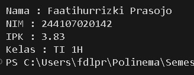

|            | Algorithm and Data Structure |
| ---------- | ---------------------------- |
| NIM        | 244107020142                 |
| Nama       | Faatihurrizki Prasojo        |
| Kelas      | TI - 1H                      |
| Repository | [link] ()                    |

# Jobsheet 2 | Object

## 2.1 Experiment 1: Class, Attribute and Method Declarations

### 2.1.3 Question Answers

1. Two characteristics of a class or object:

   - Combines data and methods in one unit, protecting data from direct access and enhancing security.

   - Allows a class to inherit attributes and methods from another class, supporting code reuse and better organization.

2. There are 4 attributes in the Student08 class, namely :

   - nim: String
   - nama: String
   - kelas: String
   - ipk: double

3. There are 4 methods in the Student08 class, namely :

   - tampilkanInformasi(): void
   - ubahKelas(kelasBaru: String): void
   - updateIpk(ipkBaru: double): void
   - nilaiKinerja(ipk: double): String

4. Modification Method updateIpk();

   - 

5. Method nilaiKinerja() determines the performance category based on the GPA score.

   - If ipk ≥ 3.5, returns “Excellent performance”.
   - If ipk ≥ 3.0, returns “Good performance”.
   - If ipk ≥ 2.0, returns “Fair performance”.
   - If ipk < 2.0, returns “Underperformance”.

   This method uses an if-else structure to give an assessment according to the GPA value.

## 2.2 Experiment 2: Instantiating Objects, and Accessing Attributes and Methods

### 2.3.3 Question Answers

1. In the StudentMain class, the line of program code used for the instantiation process is  with the resulting object being “mhs1”.
2. - How to access attributes by usingObjectname.attribute to get or change the attribute value.
   - How to access methods by usingObjectname.method() to call the method.
3. The output results of the first and second call of the showInformation() method are different because there are changes made to the attributes of the mhs1 object between the two calls.
   

## 2.3 Experiment 3: Creating a Constructor

### 2.3.3 Question Answers

1. In the student class, the line used to declare the parameterized constructor is
   - 
2. This program line creates a new object of class Student08, initializes its attributes with the given values, and stores the object's reference in variable mhs3 and to interact with the object, such as calling methods or accessing attributes.

3. If the default constructor in class Student08 is removed it will error in class StudentMain08 main because we must always provide the appropriate arguments for existing parameterized constructors, if we want to keep the ability to create objects without parameters, you must redefine the default constructor.

4. The methods in the Student08 class (or any other class) do not have to be accessed sequentially after instantiating the object because each method in the class functions independently and the conditions and program logic used in certain circumstances also affect this.

5. - Create a new object : 
   - compile and run : 

---

The solution was implemented in the praktikum 1,2,3 and here is a screenshot of the result.

## 2.4 Practical Exercise

### 1. The solution was implemented in the Case 1 and here is a screenshot of the result.

**Brief Explanation:**

1. Atribut

- kodeMk: String
- nama: String
- sks: int
- jumlahJam: int

2. Method

- tampilInformasi(): ... Serves to display all information related to the course.

- ubahSKS(int sksBaru): this method allows changing the SKS value for courses

- tambahJam(int jam): This method adds additional hours to the existing hours for the course.

- kurangiJam() : serves to reduce the number of hours of the course
  Before subtracting, this method checks to make sure that there are enough hours left to subtract. If the number of hours is insufficient (the initial number of hours is smaller than the subtraction hours), this method will notify the user that the subtraction cannot be performed. If the subtraction is successful, this method updates the number of hours and prints the new number of hours value.

### 2. The solution was implemented in the Case 2 and here is a screenshot of the result.

**Brief Explanation:**

1. Atribut

- idDosen: String
- nama: String
- statusAktif: boolean
- tahunBergabung: int

2. Method

- tampilInformasi( ): Serves to display all information related to the course.

- setStatusAktif(status: boolean): This method is used to set the lecturer's active status. If the status parameter is set to true, the lecturer becomes active. Otherwise, if false, the lecturer is declared inactive.

- hitungMasaKerja(thnSkrg: int): This method calculates and returns the length of service of lecturers in years, based on the year of joining and the current year (thnSkrg) which are the input parameters of this method. The result of the calculation provides information about the length of time the lecturer has worked at the university.

- ubahKeahlian(bidang: String): This method is used to change the lecturer's field of expertise.
