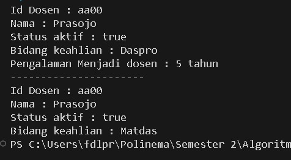

|            | Algorithm and Data Structure |
| ---------- | ---------------------------- |
| NIM        | 244107020142                 |
| Nama       | Faatihurrizki Prasojo        |
| Kelas      | TI - 1H                      |
| Repository | [link] ()                    |

# Jobsheet 2 | Object

## 2.1 Praktikum 1 : Deklarasi Class, Atribut dan Method

### 2.1.3 Jawaban Pertanyaan

1. Dua karakteristik class atau object :

   - Menggabungkan data dan metode dalam satu unit, melindungi data dari akses langsung dan meningkatkan keamanan.

   - Memungkinkan sebuah class untuk mewarisi atribut dan metode dari class lain, mendukung penggunaan kembali kode dan pengorganisasian yang lebih baik.

2. Ada 4 atribut pada class Mahasiswa08 yaitu :
   - nim: String
   - nama: String
   - kelas: String
   - ipk: double
3. Ada 4 method dalam kelas tersebut yaitu :
   - tampilkanInformasi(): void
   - ubahKelas(kelasBaru: String): void
   - updateIpk(ipkBaru: double): void
   - nilaiKinerja(ipk: double): String
4. Modifikasi Method updateIpk();
   - 
5. Method nilaiKinerja() menentukan kategori kinerja berdasarkan nilai IPK.

   - Jika ipk ≥ 3.5, mengembalikan "Kinerja sangat baik".
   - Jika ipk ≥ 3.0, mengembalikan "Kinerja baik".
   - Jika ipk ≥ 2.0, mengembalikan "Kinerja cukup".
   - Jika ipk < 2.0, mengembalikan "Kinerja kurang".

   Method ini menggunakan struktur if-else untuk memberikan penilaian sesuai dengan nilai IPK.

## 2.2 Percobaan 2 : Instansiasi Objek, serta Mengakses Atribut dan Method

### 2.3.3 Jawaban Pertanyaan

1. Pada class MahasiswaMain, baris kode program yang digunakan untuk proses instansiasi adalah  dengan object yang dihasilan adalah "mhs1"
2. - Cara mengakses atribut dengan mengunakan namaObjek.atribut untuk mendapatkan atau mengubah nilai atribut.
   - Cara mengakses method dengan mengunakan namaObjek.method() untuk memanggil method.
3. Hasil output pemanggilan method tampilkanInformasi() pertama dan kedua berbeda karena ada perubahan yang dilakukan pada atribut objek mhs1 antara kedua pemanggilan tersebut.
   

## 2.3 Percobaan 3 : Membuat Konstruktor

### 2.3.3 Jawaban Pertanyaan

1. Pada class mahasiswa, baris yang digunakan untuk mendeklarasikan konstruktor berparameter adalah
   - 
2. Baris program ini menciptakan objek baru dari class Mahasiswa08, menginisialisasi atributnya dengan nilai yang diberikan, dan menyimpan referensi objek tersebut dalam variabel mhs3 dan untuk berinteraksi dengan objek tersebut, seperti memanggil method atau mengakses atribut.

3. Jika konstruktor default pada class Mahasiswa08 dihapus maka akan error di class MahasiswaMain08 main karena kita harus selalu menyediakan argumen yang sesuai untuk konstruktor berparameter yang ada, jika kita ingin tetap memiliki kemampuan untuk membuat objek tanpa parameter, Anda harus mendefinisikan kembali konstruktor default.

4. Method di dalam class Mahasiswa08 (atau class lainnya) tidak harus diakses secara berurutan setelah melakukan instansiasi objek karena setiap method dalam class berfungsi secara independen dam kondisi serta logika program yang digunakan dalam keadaan tertentu juga mempengaruhi hal tersebut

5. - Buat object baru : 
   - compile dan run : 

---

The solution was implemented in the praktikum 1,2,3 and here is a screenshot of the result.

## 2.4 Latihan Praktikum

### 1. The solution was implemented in the Case 1 and here is a screenshot of the result.

**Brief Explanation:**

1. Atribut

- kodeMk: String
- nama: String
- sks: int
- jumlahJam: int

2. Method

- tampilInformasi(): ... Berfungsi untuk menampilkan semua informasi berkaitan dengan mata kuliah

- ubahSKS(int sksBaru): method ini memungkinkan pengubahan nilai SKS untuk mata kuliah

- tambahJam(int jam): method ini menambahkan jumlah jam tambahan ke jumlah jam yang sudah ada untuk mata kuliah

- kurangiJam() : berfungsi untuk mengurangi jumlah jam dari mata
  kuliah, Sebelum mengurangi, method ini melakukan pengecekan untuk memastikan
  bahwa jumlah jam yang tersisa cukup untuk dikurangi. Jika jumlah jam tidak mencukupi
  (jumlah jam awal lebih kecil dari jam pengurang), method ini akan memberi tahu
  pengguna bahwa pengurangan tidak dapat dilakukan. Jika pengurangan berhasil, method
  ini mengupdate jumlah jam dan mencetak nilai jumlah jam yang baru

### 2. The solution was implemented in the Case 2 and here is a screenshot of the result.

**Brief Explanation:**

1. Atribut

- idDosen: String
- nama: String
- statusAktif: boolean
- tahunBergabung: int

2. Method

- tampilInformasi( ): Berfungsi untuk menampilkan semua informasi berkaitan dengan mata kuliah

- setStatusAktif(status: boolean): method ini digunakan untuk mengatur status aktif dosen. Jika parameter status diatur ke true, berarti dosen tersebut menjadi aktif. Sebaliknya, jika false, dosen tersebut dinyatakan tidak aktif

- hitungMasaKerja(thnSkrg: int): method ini menghitung dan mengembalikan (me-returnkan) masa kerja dosen dalam tahun, berdasarkan tahun bergabung dan tahun saat ini (thnSkrg) yang menjadi parameter input method ini. Hasil perhitungan memberikan informasi tentang lamanya dosen bekerja di perguruan tinggi.

- ubahKeahlian(bidang: String): method ini digunakan untuk mengubah bidang keahlian
  dosen.
