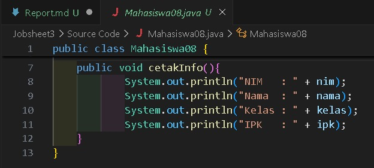
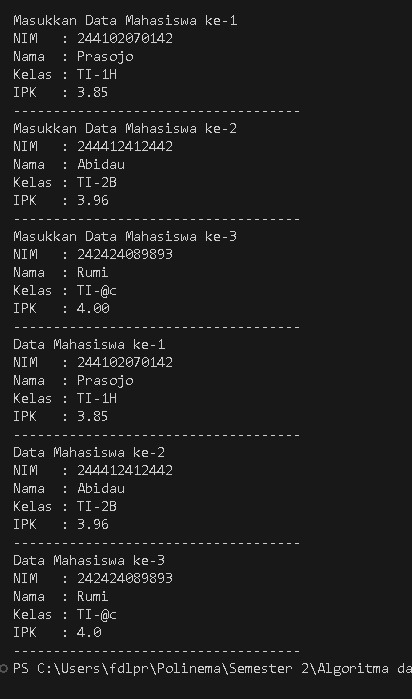
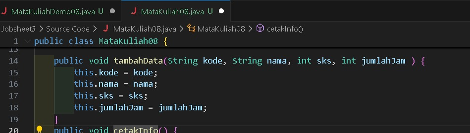
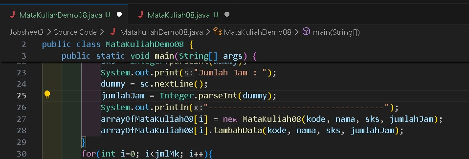
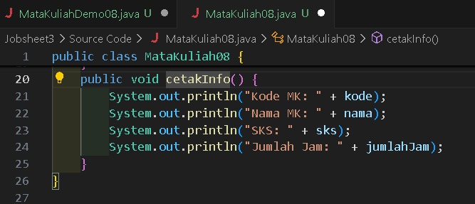
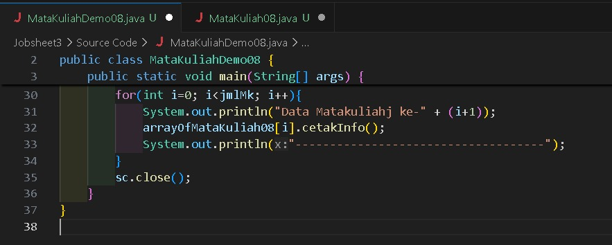
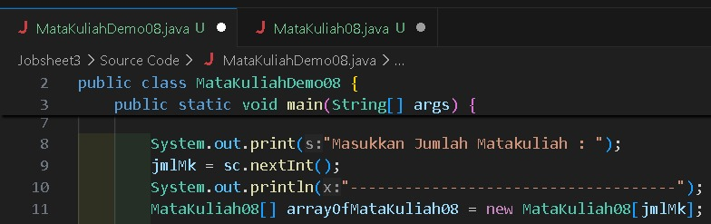
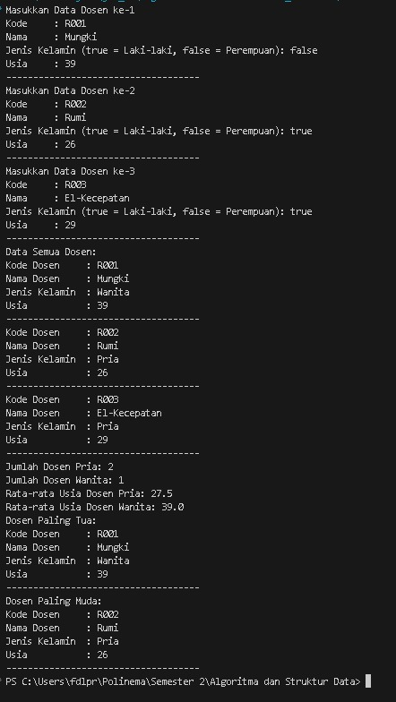

|            | Algorithm and Data Structure                                   |
| ---------- | -------------------------------------------------------------- |
| NIM        | 244107020142                                                   |
| Nama       | Faatihurrizki Prasojo                                          |
| Kelas      | TI - 1H                                                        |
| Repository | [link] (https://github.com/FaatPrasojo/Algoritma_StrukturData) |

# Jobsheet 3 | Array of Object

## 3.2 Membuat Array dari Object, Mengisi dan Menampilkan

### Jawaban Pertanyaan 3.2.3

1. Atribut: Tidak wajib. Class dapat memiliki atribut untuk menyimpan data, tetapi tidak harus. Anda bisa membuat array of objects dari class tanpa atribut.

   Method: Juga tidak wajib. Class dapat berfungsi tanpa method. Namun, jika Anda ingin melakukan operasi pada data, method akan sangat berguna.

   Contoh: Anda bisa membuat array dari class kosong (tanpa atribut dan method) seperti ini:

   > class EmptyClass { } EmptyClass[ ] objArray = new EmptyClass[5];

2. yang dilakukan kode program berikut

   > Mahasiswa[ ] arrayOfMahasiswa = new Mahasiswa[3];

   adalah konstruktor yang membuat sebuah array bernama arrayOfMahasiswa yang dapat menampung 3 objek dari class Mahasiswa

3. ya, class Mahasiswa dapat memiliki konstruktor. Jika sebuah class tidak memiliki konstruktor yang didefinisikan secara eksplisit, Java secara otomatis menyediakan konstruktor default tanpa parameter54. Konstruktor default ini akan menginisialisasi atribut objek dengan nilai default yang sesuai (misalnya, null untuk tipe objek atau 0 untuk tipe data numerik)

4. > arrayOfMahasiswa[0] = new Mahasiswa();\
   > arrayOfMahasiswa[0].nim = "24410706003";\
   > arrayOfMahasiswa[0].nama = "AGNES TITANIA KINANTI";\
   > arrayOfMahasiswa[0].kelas = "SIB-1E";\
   > arrayOfMahasiswa[0].ipk = (float) 3.75;

   yang dilakukan program tersebut adalah menginputkan atribut yang ada di dalam objek arrayOfMahasiswa

5. karena class Mahasiswa adalah tempat untuk mendeklarasikan mahasiswa sebagai objek yang didalamnya memiliki atribut, sedangkan class MahasiswaDemo adalah tempat untuk menginputkan atribut yang sudah di deklarasikan di class Mahasiswa

### Jawaban Pertanyaan 3.3.3

1.  Tambahkan method cetakInfo( ) pada class Mahasiswa berikut :

    > 

    modifikasi kode program pad class MahasiswaDemo seperti berikut :

    > 

2.  > Mahasiswa08[] myArrayOfMahasiswa = new Mahasiswa[3];\

        myArrayOfMahasiswa[0].nim = "24410706003";\
        myArrayOfMahasiswa[0].nama = "AGNES TITANIA KINANTI";\
        myArrayOfMahasiswa[0].kelas = "SIB-1E";\
        myArrayOfMahasiswa[0].ipk = (float) 3.75;

    Kode diatas error karena tidak adanya inisialisasi pada objek array myArrayOfMahasiswa

### Hasil Run Kode Program

- 

## 3.4 Constructor Berparameter

### 3.4.3 Jawaban Pertanyaan

1.  Ya, suatu class di Java dapat memiliki lebih dari satu konstruktor yang dikenal dengan **overloading konstruktor**. Overloading konstruktor memungkinkan Anda untuk membuat beberapa konstruktor dengan nama yang sama tetapi dengan parameter yang berbeda. Ini memberikan fleksibilitas dalam cara Anda menginisialisasi objek dari class tersebut.

    contohnya :

    > public Mahasiswa08(String nama, String nim, String kelas, double ipk) {\

        this.nama = nama;\
        this.nim = nim;\
        this.kelas = kelas;\
        this.ipk = ipk;\

    }\
    public Mahasiswa08(String nama, String nim) {\
     this.nama = nama;\
     this.nim = nim;\
     this.kelas = "Tidak Diketahui";\
     this.ipk = 0.0;\
    }

2.  Tambahkan method tambahData() pada class Matakuliah, kemudian gunakan method tersebut di class MatakuliahDemo untuk menambahkan data Matakuliah

        > **Class Matakuliah**\

    

        > **Class MatakuliahDemo**\

    

3.  Tambahkan method cetakInfo() pada class Matakuliah, kemudian gunakan method tersebut di class MatakuliahDemo untuk menampilkan data hasil inputan di layar >**Class Matakuliah**\
    

        >**Class MatakuliahDemo**\

    

4.  Modifikasi kode program pada class MatakuliahDemo agar panjang (jumlah elemen) dari array of object Matakuliah ditentukan oleh user melalui input dengan Scanner
    > 

## Tugas

### Output

- 
