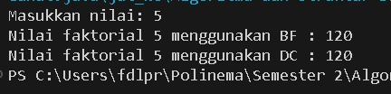
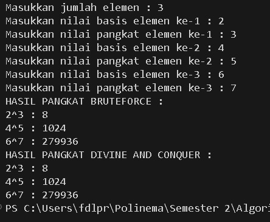
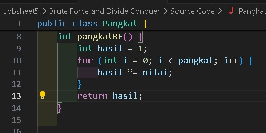
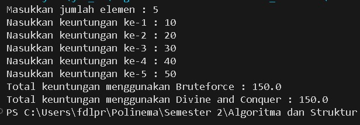
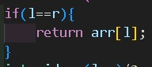
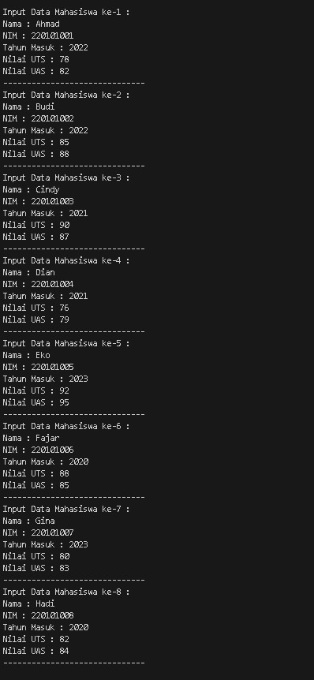
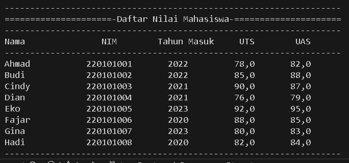
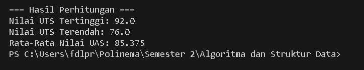

|            | Algorithm and Data Structure                                   |
| ---------- | -------------------------------------------------------------- |
| NIM        | 244107020142                                                   |
| Nama       | Faatihurrizki Prasojo                                          |
| Kelas      | TI - 1H                                                        |
| Repository | [link] (https://github.com/FaatPrasojo/Algoritma_StrukturData) |

# Jobsheet 5 | Brute Force and Divine Conquer

## 5.2 Menghitung Nilai Faktorial dengan Algoritma Brute Force dan Divine Conquer

### 5.2.2. Verifikasi Hasil Percobaan

### 5.2.3. Pertanyaan

1. - if : Menangani kondisi dasar (basis) dari rekursi, yang menghentikan pemanggilan lebih lanjut dan memberikan nilai dasar untuk faktorial.
   - else: Menangani kasus rekursif, di mana fungsi memanggil dirinya sendiri untuk menghitung faktorial dari nilai yang lebih kecil.

2. Ya, memungkinkan untuk mengubah metode perulangan dalam fungsi **faktorialBF()** dari menggunakan for menjadi menggunakan metode lain, seperti **while** atau **do-while**\

   > Source Code **do-while** :
   > 

3. - **fakto** \***_= i;_** biasanya digunakan dalam loop untuk menghitung produk secara bertahap.
   - **int fakto = n \* faktorialDC(n-1);** digunakan dalam fungsi rekursif untuk menghitung faktorial dengan memecah masalah menjadi sub-masalah yang lebih kecil.

4. **faktorialBF()** dan **faktorialDC()** adalah dua pendekatan yang valid untuk menghitung faktorial, masing-masing dengan kelebihan dan kekurangan. Pilihan antara keduanya tergantung pada konteks penggunaan seperti ukuran input dan kebutuhan memori. Pendekatan iteratif lebih cocok untuk aplikasi yang memerlukan efisiensi, sementara pendekatan rekursif lebih cocok untuk situasi di mana kejelasan dan kesederhanaan kode lebih diutamakan

## 5.3 Menghitung Hasil Pangkat dengan Algoritma Brute Force dan Divine Conquer

### 5.3.2. Verifikasi Hasil Percobaan

### 5.3.3. Pertanyaan

1. Perbedaan method pangkatBF() dan pangkatDC() adalah pangkatBF() fungsi iteratif lebih sederhana dan mudah dipahami, tetapi kurang efisien untuk nilai n yang besar. Di sisi lain, pangkatDC() fungsi rekursif lebih efisien dalam hal waktu eksekusi untuk nilai n yang besar, tetapi menggunakan lebih banyak memori dan dapat menyebabkan masalah jika n sangat besar. Pilihan antara keduanya tergantung pada konteks penggunaan, ukuran input, dan kebutuhan efisiensi.

2. Ya, tahap combine sudah termasuk dalam kode tersebut pada method pangkatBF()

   > pangkatDC(a, n/2)

3. Penggunaan parameter dalam metode tersebut masih relevan, terutama jika Anda ingin menghitung pangkat dari nilai yang berbeda tanpa mengubah atribut kelas.

   > Implementasi **pangkatBF()** jika tidak menggunakan parameter :
   > 

4. Method **pangkatBF()**

   > Cara Kerja:\
   > -Input: Metode ini menerima dua parameter: a (nilai yang akan dipangkatkan) dan n (pangkat).\
   > -Inisialisasi: Metode menginisialisasi variabel hasil dengan nilai 1. Ini akan digunakan untuk menyimpan hasil akhir dari perhitungan pangkat.\
   > -Loop: Menggunakan loop for, metode ini mengalikan hasil dengan a sebanyak n kali. Setiap iterasi dari loop mengalikan hasil dengan a, sehingga setelah n iterasi, hasil akan berisi nilai ( a^n ).\
   > -Output: Setelah loop selesai, metode mengembalikan nilai hasil, yang merupakan hasil dari perhitungan pangkat.

   Method **pangkatDC()**

   > Cara Kerja:\
   > Input : Metode ini juga menerima dua parameter: a (nilai yang akan dipangkatkan) dan n (pangkat).\
   > Basis Kasus : Jika n sama dengan 1, metode mengembalikan a. Ini adalah kondisi dasar untuk menghentikan rekursi.\
   > Rekursi : \
   > Jika n genap, metode memanggil dirinya sendiri dengan n/2 dan mengalikan hasilnya dengan dirinya sendiri. Ini berarti ( a^n = (a^{n/2}) \times (a^{n/2}) ).\
   > Jika n ganjil, metode juga memanggil dirinya sendiri dengan n/2, tetapi mengalikan hasilnya dengan dirinya sendiri dan juga dengan a. Ini berarti ( a^n = (a^{n/2}) \times (a^{n/2}) \times a ).\
   > Output : Metode mengembalikan hasil akhir dari perhitungan pangkat.

## 5.4 Menghitung Sum Array dengan Algoritma Brute Force dan Divide and Conquer

### 5.4.2 Verifikasi Hasil Percobaan

### 5.4.3. Pertanyaan

1. Variabel **mid** dalam metode **totalDC()** digunakan untuk membagi array menjadi dua bagian yang lebih kecil supaya mengurangi kompleksitas perhitungan Divide and Conquer dan membuat algoritma lebih efisien dengan memecah masalah menjadi sub-masalah yang lebih kecil.

2. - Pernyataan **double lsum = totalDC(arr, l, mid);** digunakan untuk menghitung jumlah elemen dari bagian kiri array, yaitu dari indeks **l** hingga **mid**.
   - Pernyataan **double rsum = totalDC(arr, mid+1, r);** digunakan untuk menghitung jumlah elemen dari bagian kanan array, yaitu dari indeks **mid + 1** hingga **r**.

3. > **return lsum+rsum;**

   digunakan untuk menggabungkan array yang tadi sudah dipecah menjadi **lsum** dam **rsum** untuk mendapat total keseluruhan dari elemen - elemen dalam array

4. base case dari **totalDC()** yaitu

   > 

5. Method **totalDC()** adalah implementasi yang efisien untuk menghitung total elemen dalam array dengan menggunakan prinsip Divide and Conquer. Dengan membagi masalah menjadi sub-masalah yang lebih kecil, menghentikan rekursi pada kondisi dasar, dan menggabungkan hasil dari sub-masalah

## 4.5 Latihan Praktikum

