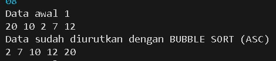
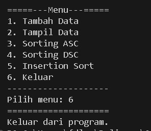

|            | Algorithm and Data Structure |
| ---------- | ---------------------------- |
| NIM        | 244107020142                 |
| Nama       | Faatihurrizki Prasojo        |
| Kelas      | TI - 1H                      |
| Repository | [link] ()                    |

# Jobsheet 6 | Sorting (Bubble, Selection, dan Insertion Sort)

## 5.2 Praktikum 1 - Mengimplementasikan Sorting menggunakan Objek

### 5.2.2 Verifikasi Hasil Percobaan (Sorting - Bubble Sort)



### 5.2.3 Verifikasi Hasil Percobaan (Sorting - Selection Sort)


### 5.2.4 Verifikasi Hasil Percobaan (Sorting - Insertion Sort)


### 5.2.5 Pertanyaan

#### Pertanyaan 1

```
if(data[j-1]>data[j]) {
    temp=data[j];
    data[j]=data[j-1];
    data[j-1]=temp;
}
```

- Kondisi `if(data[j-1]>data[j])` = kode ini memeriksa apakah elemen pada indeks `j-1` lebih besar dari elemen pada indeks `j`. jika kondisi ini benar, maka dua elemen tersebut berada dalam urutan yang salah dan perlu ditukar.
- `temp = data[j]` untuk menyimpan nilai elemen pada indeks `j` kedalam variabel sementara `temp`.
- `data[j] = data[j-1]` untuk mengganti nilai elemen pada indeks `j` dengan nilai elemen pada indeks `j-1`.
- `data[j-1] = temp` untuk mengganti nilai elemen pada indeks `j-1` dengan nilai yang disimpan dalam `temp`, yaitu nilai awal dari `data[j]`

Kesimpulannya adalah kode di atas berfungsi untuk mengurutkan eleme dalam array `data` dengan cara membandingkan elemen pada indeks `j` dengan `j-1` dan menukarnya jika urutannya salah, proses ini diulang hingga seluruh array terurut

#### Pertanyaan 2

Kode program yang merupakan algoritma pencarian nilai minimum pada selection sort

```
    for (int i = 0; i < jumData-1; i++) {
        int min = i;
        for (int j = i+1; j < jumData; j++) {
            if(data[j]<data[min]){
                min = j;
            }
        }
        int temp = data[i];
        data[i] = data[min];
        data[min] = temp;
    }
```

#### Pertanyaan 3

Maksud dari kondisi pada perulangan `while (j >= 0 && data[j] > temp)` adalah

- `j >= 0` memastikan bahwa indeks `j` tidak keluar dari batas array, jadi `j` harus lebih besar atau sama dengan 0 untuk menghindari akses elemen diluar batas array
- `data[j] > temp` memeriksa elemen indeks `j` lebih besar dari nilai yang disimpan dalam `temp`. jika `data[j]` lebih besar dari `temp` maka `temp` harus ditempatkan di posisi sebelum `data[j]` dengan mengurangi `j` untuk menemukan posisi yang tepat untuk `temp`

#### Pertanyaan 4

Tujuan dari perintah `data[j+1] = data[j]` pada Insertoin sort adalah perintah yang digunakan untuk memindahkan elemen pada indeks `j` yang lebih besar dari elemen pada indeks `j+1` agar memberikan ruang untuk elemen `temp` agar dapat diletakkan di posisi yang tepat

## 5.3 Praktikum 2 - (Sorting Menggunakan Array of Objek)

### 5.3.3 Verifikasi Hasil Percobaan


### 5.3.4 Pertanyaan

#### Pertanyaan 1

Perulangan di dalam `bubbleSort()`

```
for (int i = 0; i <listMhs.length-1; i++){
    for(int j=1; j<listMhs.length-i; j++){
```

a. Syarat dari perulangan i adalah `i < listMhs.length-1` karena untuk menghindari perbandingan yang tidak perlu pada elemen terakhir yang sudah terurut dan untuk mengurangi jumlah iterasi yang diperlukan dalam proses pengurutan.

b. Syarat dari perulangan j adalah `j<listMhs.length-i` karena untuk memastikan bahwa kita hanya membandingkan elemen yang belum terurut dalam setiap iterasi

c. Jika banyak data di dalam listMhs adalah 50, maka perulangan i akan berlangsung sebanyak `49 kali` Dan ada `1225 Tahap bubble sort` yang ditempuh

```
Sn = (n(n-1))/2
S50 = (50(50-1))/2
S50 = (50(49))/2
S50 = 1225
```

#### Pertanyaan 2

Modifikasi program dimana data mahasiswa bersifat dinamis (input dari keyborad) yang terdiri dari nim, nama, kelas, dan ipk

```
KODE PROGRAM Modifikasi

        for (int i = 0; i < 5; i++) {
            System.out.println("Masukkan data Mahasiswa ke- " + (i+1));
            System.out.print("NIM : ");
            String nim = sc.nextLine();
            System.out.print("Nama : ");
            String nama = sc.nextLine();
            System.out.print("Kelas : ");
            String kelas = sc.nextLine();
            System.out.print("IPK : ");
            double ipk = sc.nextDouble();
            sc.nextLine();

            Mahasiswa08 m = new Mahasiswa08(nim, nama, kelas, ipk);
            list.tambah(m);
```

### 5.3.6 Verifikasi Hasil Percobaan

`Selection Sort`


### 5.3.7 Pertanyaan

Di dalam method selection sort, terdapat baris program seperti dibawah ini:

```
int idxMin = i;
    for (int j = i+1; j < listMhs.length; j++) {
        if (listMhs[j].ipk<listMhs[idxMin].ipk) {
        idxMin=j;
        }
    }
```

Program ini bertujuan untuk menemukan indeks dari elemen terkecil dalam bagian yang belum terurut dari array.

- Loop ini dimulai dari `i + 1` hingga akhir array `listMhs.length`. Tujuannya adalah untuk membandingkan elemen-elemen yang tersisa di bagian yang belum terurut dari array.
- Di dalam loop, terjadi perbandingan IPK dari elemen saat ini `listMhs[j].ipk` dengan IPK dari elemen yang dianggap terkecil saat ini `listMhs[idxMin].ipk`.

### 5.4.2 Verifikasi Hasil Percobaan

`Insertion Sort`


### 5.4.3 Pertanyaan

Ubahlah fungsi pada InsertionSort sehingga fungsi ini dapat melaksanakan proses sorting dengan cara descending

```
Modifikasi Program

  void insertionSort() {
        for (int i = 1; i < lisMhs.length; i++) {
            Mahasiswa temp = lisMhs[i];
            int j = i;
            while (j > 0 && lisMhs[j-1].ipk < temp.ipk) {
                lisMhs[j] = lisMhs[j-1];
                j--;
            }
            lisMhs[j] = temp;
        }
  }
```

Perubahan terjadi pada kode program `lisMhs[j-1].ipk < temp.ipk` yang sebelumnya `lisMhs[j-1].ipk > temp.ipk`.

## 5.5 Latihan Praktikum



