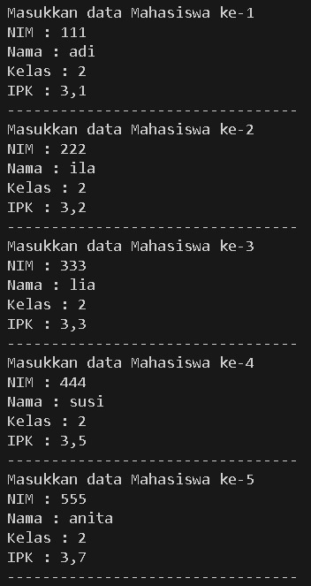
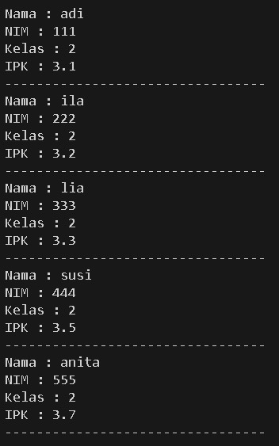
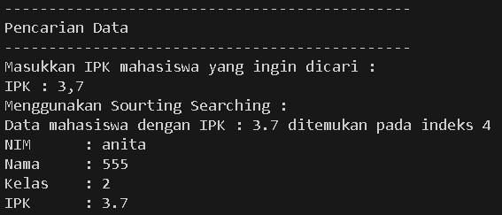
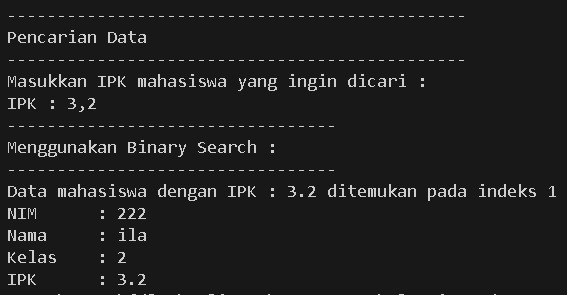
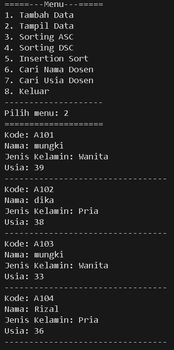
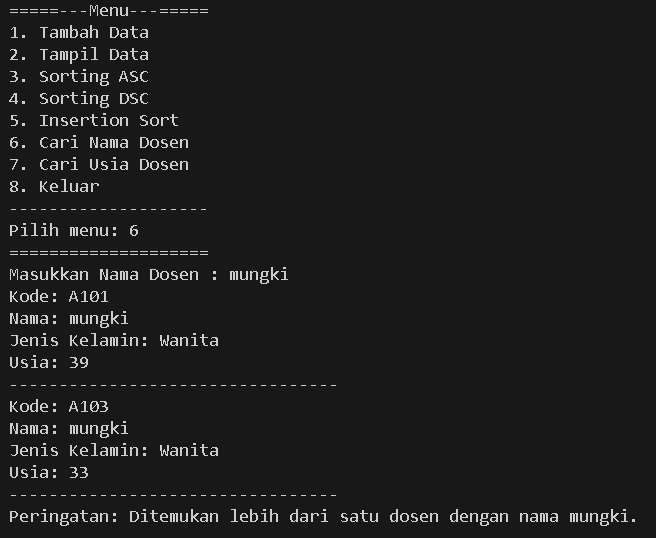
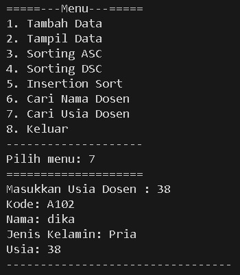

|            | Algorithm and Data Structure |
| ---------- | ---------------------------- |
| NIM        | 244107020142                 |
| Nama       | Faatihurrizki Prasojo        |
| Kelas      | TI - 1H                      |
| Repository | [link] ()                    |

# Jobsheet 7 | Searching

## 6.2 Searching / Pencarian Menggunakan Algoritma Sequential Search

### 6.2.2 Verifikasi Hasil Percobaan







### 6.2.3 Pertanyaan

#### Pertanyaan 1

Perbedaan antara method `tampilDataSearch` dan `tampilPosisi` pada class MahasiswaBerprestasi adalah

- `tampilPosisi` menampilkan posisi dari data yang dicari, hanya menampilkan indeks data mahasiswa dengan ipk yang diinputkan.
- `tampilDataSearch` menampilkan data mahasiswa dengan detail yang menampilkan nama, nim, kelas, dan ipk yang telah disearch.

#### Pertanyaan 2

```
if (listMhs[j].ipk == cari) {
    posisi = j;
    break;
}
```

Fungsi `break` pada program di atas adalah digunakan untuk menghentikan eksekusi dari loop (perulangan) yang sedang berjalan. Dalam konteks kode yang diberikan, jika kondisi `listMhs[j].ipk == cari` terpenuhi, maka variabel posisi akan diisi dengan nilai j, dan perulangan akan dihentikan dengan perintah `break`.

## 6.3 Searching / Pencarian Menggunakan Binary Search

### 6.3.2 Verifikasi Hasil Percobaan



### 6.3.3 Pertanyaan

#### Pertanyaan 1

Kode program yang menunjukan proses divide dijalankan adalah

```
mid = (left+right)/2
```

#### Pertanyaan 2

Kode progran yang menunjukan proses conquer dijalankan adalah

```
else if (listMhs[mid].ipk>cari){
    return findBinarySearch(cari, left, mid-1);
} else {
    return findBinarySearch(cari, mid+1, right);
}
```

#### Pertanyaan 3

Jika data IPK yang dimasukkan tidak urut, program masih dapat berjalan karena dalam potongan kode tersebut, tidak ada logika yang memeriksa urutan nilai IPK yang dimasukkan. Program hanya meminta pengguna untuk memasukkan data mahasiswa (NIM, nama, kelas, dan IPK) dalam sebuah loop sebanyak `x` kali. Setiap kali data dimasukkan, objek `Mahasiswa08` baru dibuat dengan data yang diberikan dan ditambahkan ke dalam `list` menggunakan metode `tambah`.

#### Pertanyaan 4

Jika IPK yang dimasukkan dari IPK terbesar ke terkecil (missal : 3.8, 3.7, 3.5, 3.4, 3.2) dan elemen yang dicari adalah 3.2. Maka hasil dari binary search tidak sesuai

`Modifikasi Kode Program`

```
int findBinarySearch(double cari, int left, int right) {
    int mid;
    if (right >= left) {
        mid = (left + right) / 2;
        if (cari == listMhs[mid].ipk) {
            return mid; // Ditemukan
        } else if (listMhs[mid].ipk < cari) { // Ubah tanda perbandingan
            return findBinarySearch(cari, left, mid - 1); // Cari di sebelah kiri
        } else {
            return findBinarySearch(cari, mid + 1, right); // Cari di sebelah kanan
        }
    }
    return -1; // Tidak ditemukan
}
```

#### Pertanyaan 5

Modifikasi Kode Program agar jumlah mahasiswa diinputkan

```
System.out.println("---------------------------------");
System.out.print("Masukkan jumlah Mahasiswa : ");
int x = sc.nextInt();
System.out.println("---------------------------------");
```

## 6.5 Latihan Praktikum






