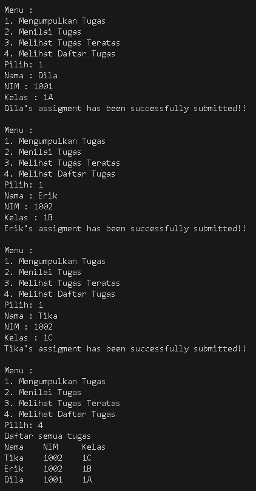
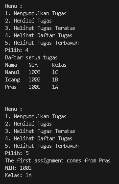
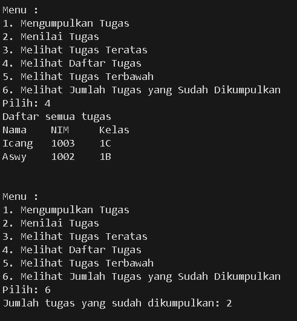
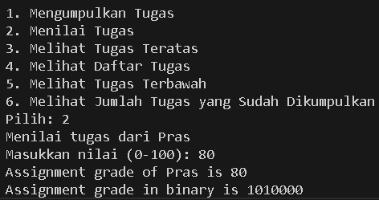
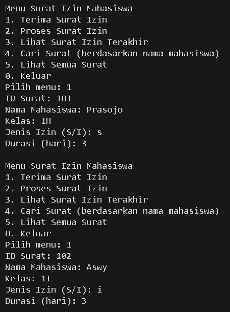
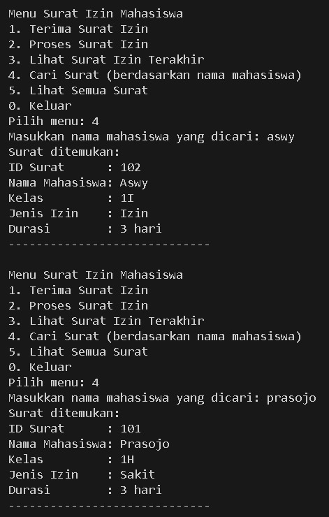
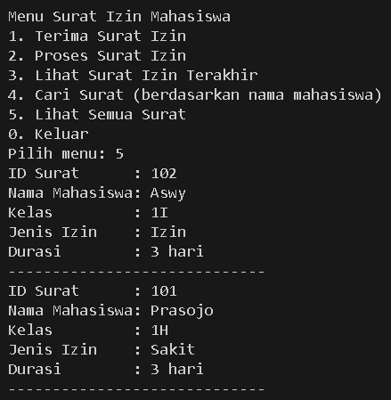
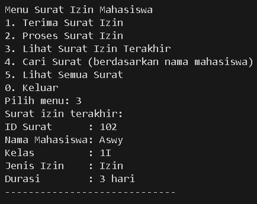
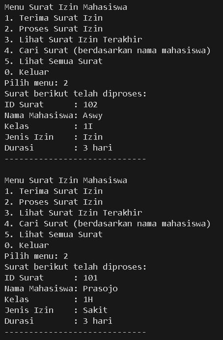
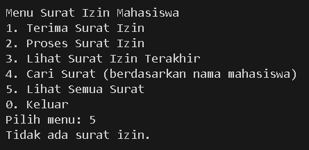

|            | Algorithm and Data Structure |
| ---------- | ---------------------------- |
| NIM        | 244107020142                 |
| Nama       | Faatihurrizki Prasojo        |
| Kelas      | TI - 1H                      |
| Repository | [link] ()                    |

# Jobsheet 9 | Stack

## 2.1 Percobaan 1 : Mahasiswa Mengumpulkan Tugas

### 2.1.3 Pertanyaan

1.  Lakukan perbaikan pada kode program, sehingga keluaran yang dihasilkan sama dengan verifikasi
    hasil percobaan! Bagian mana yang perlu diperbaiki?

    Jawaban : Bagian yang perlu diperbaiki adalah method `void print()` pada class StackTugasMahasiswa

        void print(){
            for(int i=top;i>=0;i--){
                System.out.println(stack[i].nim + "\t" + stack[i].name + "\t" + stack[i].className);
            }
            System.out.println("");
        }

    dengan output yang dihasilkan setelah perbaikan sesuai dengan hasil percobaan

    

2.  Berapa banyak data tugas mahasiswa yang dapat ditampung di dalam Stack? Tunjukkan potongan
    kode programnya!

Jawaban : Data tugas mahasiswa yang dapat ditampung di dalam Stack adalah 5 tugas

```
StackTugasMahasiswa08 stack = new StackTugasMahasiswa08(5);
```

3.  Mengapa perlu pengecekan kondisi !isFull() pada method push? Kalau kondisi if-else tersebut
    dihapus, apa dampaknya?

        Jawaban :
        - Pengecekan !isFull() pada push mencegah stack overflow dan error runtime.

        - Jika dihapus, bisa terjadi penulisan data di luar batas, error, atau data stack rusak.

        - Pengecekan ini adalah bagian penting dari operasi dasar stack.

4.  Modifikasi kode program pada class MahasiswaDemo dan StackTugasMahasiswa sehingga
    pengguna juga dapat melihat mahasiswa yang pertama kali mengumpulkan tugas melalui operasi
    lihat tugas terbawah!

    Jawaban :

    Pada class `StackTugasMahasiswa` terdapat penambahan method :

        ```
        public Mahasiswa08 bottom() {
            if (top >= 0) {
                return stack[0];
            } else {
                return null;
            }
        }
        ```

    Pada class `MahasiswaDemo` terdapat penambahan Source Code dan penyesuaian pada perulangan :

    ```
        case 5:
            Mahasiswa08 terbawah = stack.bottom();
            if (terbawah != null) {
                System.out.println("The first assignment comes from " + terbawah.name);
                System.out.println("NIM: " + terbawah.nim);
                System.out.println("Kelas: " + terbawah.className);
            } else {
                System.out.println("Stack is empty.");
            }
            break;
    ```

    ```
    while (pilih >= 1 && pilih <=5);
    ```

    Outputnya :

    

5.  Tambahkan method untuk dapat menghitung berapa banyak tugas yang sudah dikumpulkan saat
    ini, serta tambahkan operasi menunya!

    Jawaban :

    Pada class `StackTugasMahasiswa` terdapat penambahan method :

    ```
    public int count() {
        return top + 1;
    }
    ```

    Pada class `MahasiswaDemo` terdapat penambahan Source Code dan penyesuaian pada perulangan :

    ```
    System.out.println("6. Melihat Jumlah Tugas yang Sudah Dikumpulkan");
    ```

    ```
    case 6:
        System.out.println("Jumlah tugas yang sudah dikumpulkan: " + stack.count());
        break;
    ```

    ```
    while (pilih >= 1 && pilih <=6);
    ```

    Outputnya :

    

## 2.2 Percobaan 2 : Konversi Nilai Tugas ke Biner

### 2.2.3 Pertanyaan

1.  Jelaskan alur kerja dari method konversiDesimalKeBiner!

    Jawaban :

    `Membuat Stack Kosong`

    ```
    ConversionStack08 stack = new ConversionStack08();
    ```

    - Membuat objek stack baru bertipe ConversionStack08 untuk menyimpan digit biner sementara

    `Proses Konversi Desimal ke Biner (Push ke Stack)`

    ```
    while (grade > 0) {
        int mod = grade % 2;
        stack.push(mod);
        grade = grade / 2;
    }
    ```

    - Selama nilai grade > 0

      - Hitung sisa bagi (mod) dari grade dibagi 2. Ini adalah digit biner (0 atau 1) paling kanan.

      - Push hasil mod ke dalam stack.

      - Bagi grade dengan 2 (menggunakan pembagian bulat/integer division) untuk memproses digit berikutnya.

    `Menyusun String Biner (Pop dari Stack)`

    ```
    String binary = "";
    while (!stack.isEmpty()) {
        binary += stack.pop();
    }
    ```

    - Selama stack tidak kosong
      - Pop satu per satu digit biner dari stack.
      - Tambahkan digit hasil pop ke string binary.

    `Pengembalian hasil`

    ```
    return binary;
    ```

    - Mengembalikan string binary sebagai hasil konversi dari desimal ke biner

    `Output`

    

2.  Pada method konversiDesimalKeBiner, ubah kondisi perulangan menjadi while (kode != 0),
    bagaimana hasilnya? Jelaskan alasannya!

        Jawaban :
        - Untuk input bilangan bulat positif dan nol, perubahan kondisi dari while (grade > 0) menjadi while (kode != 0) tidak mempengaruhi hasil.

        - Untuk input bilangan negatif, perubahan ini berbahaya karena dapat menyebabkan infinite loop atau hasil yang tidak diinginkan.

        - Sebaiknya tetap gunakan while (grade > 0) untuk memastikan hanya bilangan positif yang diproses dan menghindari infinite loop pada input negatif.

        `Alasan`
        - Konversi desimal ke biner hanya bermakna untuk bilangan bulat positif (dan nol).

        - Dengan while (grade > 0), program aman dari input negatif.

        - Dengan while (kode != 0), program bisa error pada input negatif.

## Tugas

`Input Surat`



`Mencari surat bedasarkan nama mahasiswa`



`Menampilkan seluruh surat`



`Pengecekan surat izin yang terakhir masuk`



`Pemrosesan izin`



`"Tidak ada surat lagi yang belum di proses" karena sudah semua sudah di proses`


